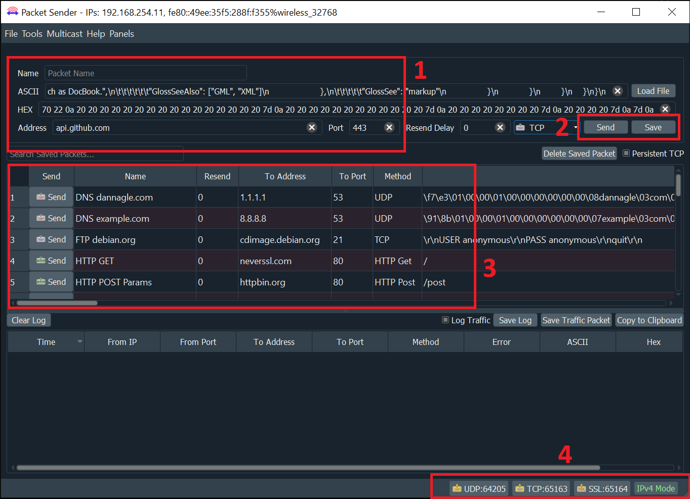
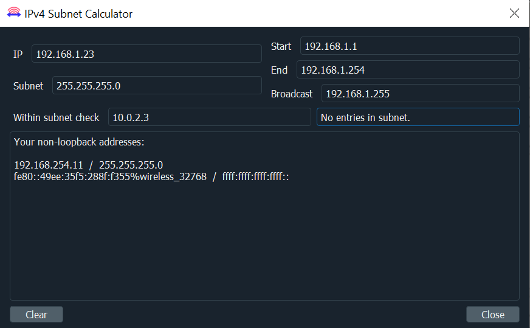
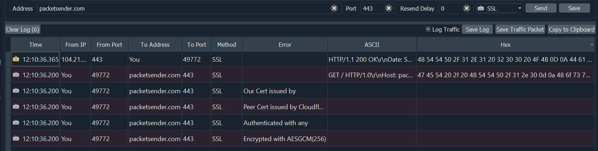
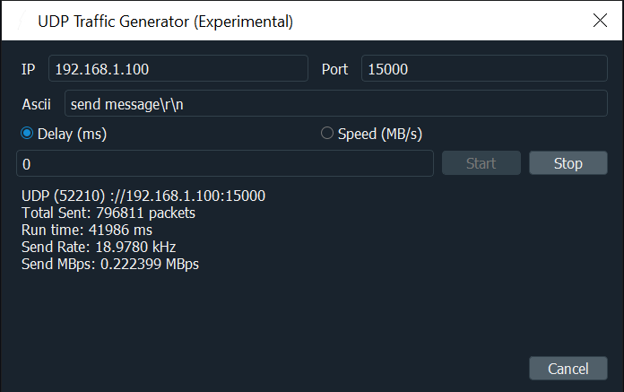
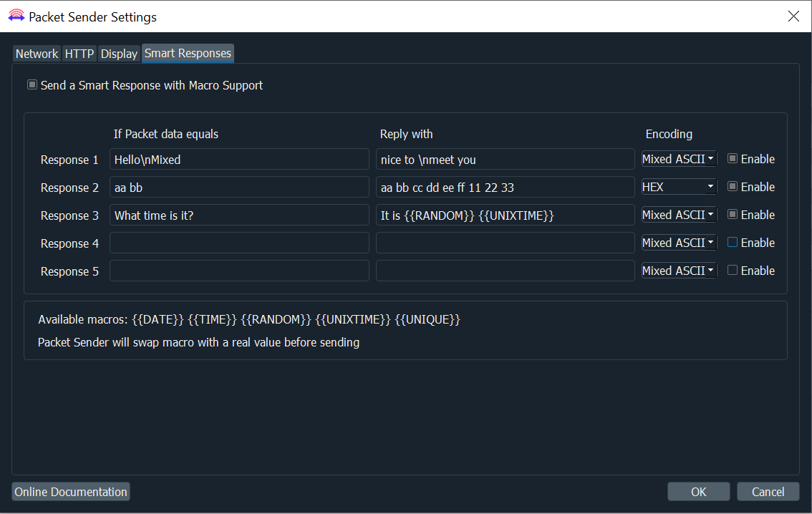
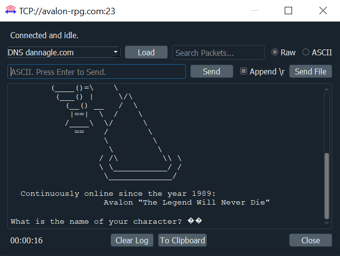

# Introduction


[](https://packetsender.com/download)

Packet Sender is an open source utility to allow sending and receiving TCP, UDP, and SSL (encrypted TCP) packets as well as HTTP/HTTPS requests and panel generation. The mainline branch officially supports Windows, Mac, and Desktop Linux (with Qt). Other places may recompile and redistribute Packet Sender. Packet Sender is free and licensed GPL v2 or later. It can be used for both commercial and personal use. If you find the app useful, please consider donating/sponsoring so development may continue.


# Table Of Contents
* [Sponsors](#sponsors)
  * Visit [IWL.com](https://www.iwl.com/)
  * Visit [NagleCode.com](https://dannagle.com/)
  * Visit [JetBrains.com](https://www.jetbrains.com/)

* [GUI](#gui)
* [Intense Traffic Generator (GUI)](#udptraffic)
* [Network](#network)
* [Downloads](#downloads)
* [Support](#support)
* [IPv4 Subnet Calculator](#subnetcalculator)
* [Packet Sender Cloud](#cloud)
* [Portable Mode](#portable)
* [Macros and Smart Responses](#smartresponses)
* [Persistent TCP and SSL](#persistent)
* [HTTP/HTTPS Requests](#http)
* [Panel Generator](#panelgen)
* [Command Line Interface](#cli)
* [Intense Traffic Generator (CLI)](#cliintensetraffic)
* [Building Packet Sender](#building)


<a id="sponsors"></a>
## Sponsors

Packet Sender would like to thank the following sponsors.

[](https://www.iwl.com/)
<br>IWL is a California company creating computer networking products.
<br><br><br>

[](https://dannagle.com)
<br>NagleCode is a software publisher and development studio. 
<br><br><br>

[](https://www.jetbrains.com/?from=PacketSender)
<br>JetBrains provides world-class programming tools to help speed development.
<br><br><br>

[Would you like your name/logo listed here?](https://github.com/sponsors/dannagle)


<a id="support"></a>
## Support

* Twitter: [@NagleCode](http://twitter.com/NagleCode)
* Forums are at: [GitHub Discussions](https://github.com/dannagle/PacketSender/discussions).
* Email: [Packet Sender Contact](https://packetsender.com/contact)
* Connect with me on [LinkedIn](https://www.linkedin.com/in/dannagle/)

*NOTE:* Try (temporarily) disabling your firewall if having problems in Windows.

<a id="downloads"></a>
# Downloads

## Desktop Download
Official releases of Packet Sender can be downloaded at  [PacketSender.com](http://packetsender.com/download). Some places redistribute Packet Sender.

  


<!--
Not sure when this will be back.

## Mobile Apps
The Packet Sender mobile editions are fully native, contain bare minimum permissions, and collects no data. This is software that respsects you. Thank you for supporting this effort.


### Android Mobile App


The Android version is located [on Google Play](https://play.google.com/store/apps/details?id=com.packetsender.compose) or [on Amazon Appstore](https://www.amazon.com/dp/B08RXM6KM2/)

[](https://play.google.com/store/apps/details?id=com.packetsender.compose

-->


## iOS Mobile App


The iOS version is located [on the Apple App Store](https://apps.apple.com/app/id1558236648#?platform=iphone)

[](https://apps.apple.com/app/id1558236648#?platform=iphone)

<a id="gui"></a>
# GUI 

Packet Sender is identical for all the desktop versions. The only difference is its theme to match the operating system.



1. A packet has a name, destination address (domain names are default resolved just before sending), port, and data associated with it.
2. In the table, there is a list of saved packets. You can double-click to directly edit fields in this table.
3. In the bottom right, there are UDP, TCP, and SSL server status and port(s). Clicking on these will activate or deactivate the protocol. Packet Sender supports binding to any number of ports.
4. There is also a IP toggle button. Clicking this changes it to IPv4 (default), IPv6, or custom IP

### General Notes
* A resend value of "0" means it is a single-shot packet.
* During packet resending, there will be a button to cancel all resends.
* Please check your firewall. Windows aggressively blocks TCP-based servers. Packet Sender will still work if the firewall blocks it, but it can't receive unsolicited TCP-based packets.
* An optional response can be sent. The same response is used for TCP,  UDP, and SSL.
* For IPv6 sending, you will also need the scope ID.
* Packet Sender supports mixed ASCII and HEX notation:
  * Double-click either field to bring up the multi-line editor
  * \XX gets translated to XX in hex
  * \n, \r, \t will get translated to 0A, 0D, and 09
  * HEX numbers are space delimited
    * The HEX field will attempt to interpret other common delimiters (such as commas, colons (Wireshark), semicolons, " 0x", etc) and auto-correct. It is very fault-tolerent.
    * A single stream of HEX is also supported. If the number of bytes is odd, Packet Sender will assume the front byte needs a zero and then auto-correct.
  * Example ASCII: hello world\r
  * Example HEX: 68 65 6c 6c 6f 20 77 6f 72 6c 64 0d
  * You may save a packet directly from the traffic log. You will be prompted for a name, and the source address and port will be switched for your convenience.
  * You may also load a file directly in to the HEX field. The HEX field supports sending up to 10,922 bytes. The theoretical limit for sending via the command line is 200 MB.


## Hotkeys/Keyboard Shortcuts

The fields at the top can be navigated using CTRL+1, CTRL+2, etc, up to CTRL+8 (send button). On Mac, the shortcut key is Command.

The hotkeys and fields are:
* CTRL + 1 = Name
* CTRL + 2 = ASCII
* CTRL + 3 = HEX
* CTRL + 4 = Address
* CTRL + 5 = Port
* CTRL + 6 = Resend Delay
* CTRL + 7 = Protocol Selection
* CTRL + 8 = Send (executes)


Some notes:
* The fields are linked to the corresponding hotkey regardless of protocol selection.
* When you navigate to the TCP/UDP/SSL option, you may use up/down or t/u/s/h characters to make a selection.
* If you are going to automate with hotkeys (using tools such at [AutoHotKey](https://www.autohotkey.com/)), you may want to turn off "Restore previous session".


<a id="network"></a>
# Network Features

## IPv4, IPv6, Custom IP

Packet Sender's built-in servers are configured to support either IPv4 or IPv6 but not both at the same time. For clients, Packet Sender GUI and CLI will seamlessly switch between the two modes upon sending (scope ID may be needed for IPv6). Click the IPv4 / IPv6 toggle on the bottom right to switch between the two.

Inside the settings, you may also force Packet Sender's servers to bind to a custom IP address. This can be very useful for systems with multiple NICs or complicated IP setups. Packet Sender will trigger an error if told to bind to an address that does not exist.


<a id="subnetcalculator"></a>
## IPv4 Subnet Calculator

Packet Sender has a built-in subnet calculator. It is under the Tools menu.


* The log window (bottom section) will display non-loopback IPv4 and IPv6 addresses found on your computer.
* On the left side, input the IPv4 address in the IP field. 
* On the left side, input the subnet in either X.X.X. or /XX notation
* The results of the calculation are on the right.
* The field below is a quick check to see if an IPv4 is within one of your subnets.

## SSL Client and Server

Packet Sender supports establishing encrypted connections over SSL.
This is supported in the GUI and on the command line.

Packet Sender bundles OpenSSL for use in Windows. On Mac and Linux, Packet Sender will use the native SSL libraries.

_This product includes software developed by the OpenSSL Project for use in the OpenSSL Toolkit. (http://www.openssl.org/)_



SSL Notes:
* The certificate negotiation is handled immediately during connection.
* By default, Packet Sender ignores all SSL errors (expired cert, wrong host name, self-signed, etc).
* Packet Sender outputs the cert negotiation progress in to the traffic log.
* Packet Sender outputs the encryption algorithm used in the traffic log (such as AES 128).

Packet Sender bundles an internal "Snake Oil" certificate for use as a server for Windows. The certificate and key is in the same place as packet and settings.

_Note: Overriding the cert locations in Settings also overrides the snake-oil certificate._

If there is an SSL error, Packet Sender will output it to the traffic log. If the setting is to continue anyway (default), it will continue to negotiate encryption. Otherwise, the connection ends with failure to connect.


## Multicast (Experimental)

Packet Sender's multicast support is triggered by attempting to send to a IPv4 multicast address or from the mulitcast submenu. The feature is currently experimental and has these known problems.

* Packet Sender abandons IPv6 support when joining multicast.
* And stays abandoned until you revisit settings or attempt to send to IPv6
* On wifi, it sometimes takes 20 seconds for multicast join to actually take effect.
* Packet Sender has no logic to rejoin a mulitcast group if the switch reboots or some other common error.

There is no IPv6 multicast support, though it is on the roadmap. Sponsors wanting IPv6 multicast support are welcome to contact me.

<a id="udptraffic"></a>

## UDP Traffic Generator (Experimental)

For when the normal send system is not enough, you can hammer a target IP with packets to see if your device can handle it. This can be found in the GUI toolbar at _Tools -> Intense Traffic Generator_

Please note that this feature is experimental and the metrics displayed have not been fully tested. For a more accurate test, you may want to look at the CLI version of this tool.



# Packet Sender Features


<a id="cloud"></a>
## Packet Sender Cloud

Packet sets can be quickly saved/retrieved/shared using the free [Packet Sender Cloud](https://cloud.packetsender.com/) service. The cloud may also be used to publicly display and distribute your packets (via an URL) for collaboration, tutorials, end users, etc. Packet Sender may import public packet sets with public URL.

There are various reasons to do this:

* Keeping all your packets ready so you can quickly retrieve them when installing a fresh Packet Sender
* Quickly swapping between packet sets when working on different projects.
* Sharing a login (it is allowed) for collaborative packet set generation
* Having a public page of your packet sets so others can quickly find and import


If you are publishing a network API, maintaining a public cloud page is significantly easier than painfully detailing (IP, port, type, etc) the packets to your users. Plus, updating that page is easy.

More information about it can be found at
https://cloud.packetsender.com/help


<a id="portable"></a>
## Portable Mode

Packet Sender has a "portable" mode. At launch, it will look for `portablemode.txt` and populate any missing settings files in that run-time directory. These files are  `packets.ini`, `ps_settings.ini`, `ps.key`, and `ps.pem`.
You may also have some files portable and the other in their standard location by removing portablemode.txt.

### DDLs that can be removed in Console-only portable Mode
If you do not require the GUI, you may remove these DDLs
- Qt5Svg.dll
- libEGL.dll
- libGLESv2.dll
- Qt5Widgets.dll
- Qt5Gui.dll
- opengl32sw.dll
- D3Dcompiler_47.dll
- iconengines directory
- imageformats directory
- styles directory

### DDLs that can be removed if you do not need secure connections
If you do not require SSL, you may remove these DDLs
- libcrypto-1_1-x64.dll
- libssl-1_1-x64.dll


The run-time directory Windows users is the same place as the .exe.

For MAC users, this run-time directory is at `PacketSender.app/Contents/MacOS`.
If INI files are found, it will use them instead of `%APPDATA%` or `Library/Application Support`.


<a id="smartresponses"></a>
## Smart Responses

Packet Sender supports up to 5 smart responses. 

To enable this feature, go to _File -> Settings_ at the GUI toolbar. Go to the _Smart Responses_ tab and enable the **Send a Smart Response** checkbox.  



* Packet Sender will compare the packet within the encoding you choose.
* Packet Sender translates the encoding before sending out the reply.
* The available encodings are:
  * Mixed ASCII -- The standard Packet Sender way of encoding ASCII along with non-printable characters
  * HEX -- Packet Sender's normal HEX encoding


## Macros

Packet Sender supports these macros when sending responses:

* {{DATE}} -- Sends the current date in "yyy-mm-dd" format.
* {{TIME}} -- Sends the current time in "hh:mm:ss ap" format.
* {{UNIXTIME}} -- Sends the current epoch time stamp.
* {{RANDOM}} -- Sends a random number ranging from either 0 to 32767 or 2147483647, depending on 32-bit or 64-bit (default installer for Windows is 32-bit. Mac is 64-bit).
* {{UNIQUE}} -- Sends a random string. Uses an internal UUID to generate it.
Packet Sender will swap the macro with real values before sending.


<a id="persistent"></a>
## Persistent TCP and SSL

Packet Sender supports persistent TCP and SSL connections via a separate GUI window. It is enabled by a checkbox on the main window or through the Settings window.



### Notes on Persistent TCP and SSL:
* Any number of persistent connections can be created.
* Previously saved packets can be loaded in the drop-down.
* There is a "Raw" view and "ASCII" view. The ASCII view is useful to troubleshoot data that is not printed by the raw view.
* Traffic is also saved in the main window traffic log.
* A file may be uploaded to the persistent connection. You may wish to turn off logging if you use this.
* The timer in the bottom left starts as soon as a valid data packet is sent/received. It stops when the connection is closed.
* You may optionally append a carriage return when you quick-send by hitting the return key. This is useful for command-prompt menus over TCP  / SSL connections. Packet Sender remembers previous state of \r checkbox.
* Incoming persistent connections to the server will launch the separate GUI window.
* During resend, the persistent connection packet is carried over to the new GUI window. Clicking "Resending(1)" will cancel it.

Persistent connections are not supported via the command line.


<a id="http"></a>
# HTTP/HTTPS POST & GET
Packet Sender supports sending POST/GET requests via HTTP and HTTPS. 
Protocol dropdown includes the following options: HTTP GET, HTTP POST, HTTPS GET, HTTPS POST. When selecting HTTP(S), input fields will udpate to: Name, Request, Address, Data (when POST is selected), Generate Data button (when POST is selected), Load FIle (when POST is selected). 

## Sending HTTP/HTTPS GET/POST Requests

* Select HTTP(S) GET or POST from the protocol dropdown
* In *Address* field input the domain or IP
* In *Request* field add the URL path, if needed
* In *Port* field, the default for HTTP is 80 and HTTPS is 443
* Check *Persistent TCP* to see the server data more clearly (HTTP headers are removed automatically). 

**You may also paste a complete URL in the Request field and Packet Sender will parse and auto-populate the other fields.**

### For POST Requests:
* You can manually add in the data into the *Data* field.
	* Format would go: key=value
	* For multiple paramaters: key=value&key=value&key=value
* Or you can click on the *Generate Data* button


* To add data, input the Key and Value parameters. Click the **+** button. 
* Can add multiple parameters with the + button. 
* Remove parameters by clicking the X button next to the parameter
* Once parameters are added, click Ok and data will be generated in the Data field. 

### To add Authentication credentials:


* Go to File -> Settings -> HTTP
* Check *Generate Auth Header*
* Input the *Host*, *UN/Client ID*, and *PW/Access*
* Click on *HTTP Auth Header* to generate the authentication header

<a id="panelgen"></a>
# Panel Generator
Packet Sender supports generating control panels. Panels consist of buttons with scripts (packets) assigned to them. Clicking the button will execute the packet(s) referenced on that button. 


## Loading a Panel
Panels can be created one of two ways:
* Clicking **Panels** on the toolbar and selecting either Load Starter Panel or Empty Panel Project
	* Load Starter Panel will load the Panel assigned as starter. If no panel is set as the starter, an empty panel project will open. 
* Highlighting 2 or more saved packets and clicking on the **Generate Panel** button (Generate Panel button only appears when multiple packets are selected) 


## Scripting a Panel
To begin scripting the buttons on your panel, you will need to open a panel and go to the Editing screen. Once a panel project is opened, check the button in the bottom right corner. If this button says "Viewing", you are on the Viewing screen. Click the button to move the panel to the Editing screen. 

Once at the Editing screen, buttons and scripts can be added to the panel. 

### Button Scripting
Button scripts will contain the name of the packet to be sent. 


Multiple packets can be set to a button by adding each name on a new line.


Panel Generator supports adding a delay between multiple packets by adding "delay:_# of seconds_" in between packets.


Panel Generator supports adding a script to load a new panel by adding "panel:_panel id #_". Once all previous scripts on the button are executed, the Panel will transition to the next panel. 


### Adding Files/URLs
Panel Generator supports adding buttons that link to locally-stored files or URLs. 
File/URL buttons can be added while in the Editing screen by clicking the *+* in the bottom right corner. 
* For files: Go to the file on the PC, right click on the file and select Copy. Paste this into the _URL or File_ textbox in Packet Sender
* For URLs: Copy the URL into the _URL or File_ textbox in Packet Sender
	* URLs must begin with http:// or https://


 

Once the file or URL is copied, you will be prompted to input a name for the button. Buttons will populate at the bottom of the panel. 

While on the Editing screen, clicking these buttons will allow you to edit the file/URL link and the name of the button. You can also delete the button by clicking the **X** on the popup. 


When on the Viewing screen, clicking these buttons will launch the URL in the default browser or open the file (with the default program for the file type). 


 

### Panel Editing/Saving
While in the Editing screen of a Panel, there will be a toolbar with menus File, Export, Settings, Help. You can save, export, import, load panel projects, and edit the current panel project from this toolbar. 

From Settings, you can do the following:
* Set Panel Name - select this to rename the current panel project
* Set Panel ID - select this to change the ID associated with the current panel project
_Note: Setting an ID in use will replace that panel_
* Starter Panel - select this to set the current panel project as the starter panel. 
* Delete Panel - This will bring up a menu of current panel projects. Select a panel project to delete it. _Note: Buttons and scripts will be retained on the Editing screen until the Panel is closed_


<a id="cli"></a>
# Command Line
Packet Sender can be used from the command line on your computer. 

For Windows, use the extension .com (`packetsender.com`) to use the command line interface. Optionally, you can also use `packetsender` without an extension. Using the extension .exe will launch the GUI. 


For Linux, the command line system in Packet Sender follows the same pattern as other Linux utilities. It has a long name (such as --version) and a short name (such as -v). These options can be arranged in any order and Packet Sender will parse them correctly. The last 3 options are positional and must appear last. They are IP, port, and data. These last options are optional if using a stored packet.

```
packetsender --help
Packet Sender is a Network UDP/TCP/SSL/HTTP Test Utility by NagleCode
See https://PacketSender.com/ for more information.

Options:
  -?, -h, --help            Displays help on commandline options.
  --help-all                Displays help including Qt specific options.
  -v, --version             Displays version information.
  -q, --quiet               Quiet mode. Only output received data.
  -x, --hex                 Parse data-to-send as hex (default for
                            TCP/UDP/SSL).
  -a, --ascii               Parse data-to-send as mixed-ascii (default for http
                            and GUI).
  -A, --ASCII               Parse data-to-send as pure ascii (no \xx
                            translation).
  -w, --wait <ms>           Wait up to <milliseconds> for a response after
                            sending. Zero means do not wait (Default).
  -f, --file <path>         Send contents of specified path. Max 10 MiB for
                            UDP, 100 MiB for TCP/SSL.
  -b, --bind <port>         Bind port. Default is 0 (dynamic).
  -6, --ipv6                Force IPv6. Same as -B "::". Default is IP:Any.
  -4, --ipv4                Force IPv4.  Same as -B "0.0.0.0". Default is
                            IP:Any.
  -B, --bindip <IP>         Bind custom IP. Default is IP:Any.
  -t, --tcp                 Send TCP (default).
  -s, --ssl                 Send SSL and ignore errors.
  -S, --SSL                 Send SSL and stop for errors.
  -u, --udp                 Send UDP.
  --http <http>             Send HTTP. Allowed values are GET (default) and
                            POST
  -n, --name <name>         Send previously saved packet named <name>. Other
                            options overrides saved packet parameters.
  --bps <bps>               Intense traffic. Calculate rate based on value of
                            bits per second.
  --num <number>            Intense traffic. Number of packets to send. Default
                            unlimited.
  --rate <Hertz>            Intense traffic. Rate. Ignored in bps option.
  --usdelay <microseconds>  Intense traffic. Resend delay. Used if rate is 0.
                            Ignored in bps option.

Arguments:
  address                   Destination address/URL. Optional for saved packet.
  port                      Destination port/POST data. Optional for saved
                            packet.
  data                      Data to send. Optional for saved packet.
```
## Example CLI
The CLI follows the same format between Windows, Linux, and MAC. 

The format is: `packetsender [options] address port data`

```
packetsender -taw 500 mirrors.xmission.com 21 "USER anonymous\r\nPASS chrome@example.com\r\n"
TCP (65505)://mirrors.xmission.com:21 55 53 45 52 20 61 6e 6f 6e 79 6d 6f 75 73 0d 0a 50 41 53 53 20 63 68 72 6f 6d 65 40 65 78 61 6d 70 6c 65 2e 63 6f 6d 0d 0a
Response Time:5:51:37.042 pm
Response HEX:32 32 30 2D 57 65 6C 63 6F 6D 65 20...
Response ASCII:220-Welcome to XMission Internet...
```

## Examples binding to port and custom IP, IPv4, or IPv6

Packet Sender command line can bind to custom ports to force IPv4/6 modes or multiple NIC using the -B option.
```
packetsender -taw 3000 fe80::c07b:d517:e339:5a08 5005 "Hello\r"
packetsender -taw 3000 192.168.0.201 5005 "Hello\r"
packetsender -B 192.168.0.200 -taw 3000 192.168.0.201 5005 "Hello\r"
packetsender -B fe80::a437:399a:3091:266a%ethernet_32769 -taw 3000 fe80::c07b:d517:e339:5a08 5005 "Hello\r"
packetsender -B fe80::a437:399a:3091:266a -taw 3000 fe80::c07b:d517:e339:5a08 5005 "Hello\r"
```

## Example CLI using SSL and ignoring errors

The command line has the option to ignore or abandon on SSL errors. The default is to ignore.

* Use -s option to send SSL and ignore errors.
* Use -S option to send SSL and stop for errors

```
packetsender -saw 500 expired.packetsender.com 443 "GET / HTTP/1.0\r\n\r\n"
SSL Error: The certificate has expired
SSL (54202)://expired.packetsender.com:443 47 45 54 20 2f 20 48 54 54 50 2f 31 2e 30 0d 0a 0d 0a
Cipher: Encrypted with AES(128)

Response Time:3:24:55.695 pm
Response HEX:48 54 54 50 2f 31 2e 31 20 34 32 31 20 0d 0a 53 65 72 76 65 72 3a 20 6e 67 69 6e 78 2f 31 2e 31 30 2e 30 20 28 55 62 75 6e 74 75 29 0d
Response ASCII:HTTP/1.1 421 \r\nServer: nginx/1.10.0 (Ubuntu)\r
```

## Example CLI using HTTP
Note this uses the built-in default packets.
```
packetsender --name "HTTPS POST Params"
packetsender --http GET "https://httpbin.org/get"
packetsender --http POST "https://httpbin.org/post" "{}"
```


<a id="cliintensetraffic"></a>

## Example using CLI Intense Traffic Generator
The command intense traffic generator works much the same way as the GUI version but it is a bit more accurate, with more control options, (and more intensity!).

See below for examples how to use it. Note that these calculations are "Best Effort". It does OK, but processor spikes or various network hiccups can throw it off. The threading is not real-time, and is not super-smart with its attempts to compensate.

* Resend "My Awesome Packet" at a rate of 20 Hz
* Resend "My Awesome Packet" at a bps of 2000 baud
* Resend "My Awesome Packet" as fast as possible
* Resend "My Awesome Packet" with 2000000 microsecond delay between each packet

**Note: For Windows, use the ".com" build, so each example would be packetsender.com**

```
packetsender --rate 20 --name "My Awesome Packet"
packetsender --bps 2000 --name "My Awesome Packet"
packetsender --rate 0 --name "My Awesome Packet"
packetsender --usdelay 2000000 --name "My Awesome Packet"
```


<a id="building"></a>
# Building Packet Sender
The only dependency is Qt SDK

## Building Packet Sender for Windows/MAC
1. Download the Qt installer from http://www.qt.io/download-open-source/
1. Let it install MingGW if you don't have a compiler.
1. Open the project PacketSender.pro
1. Build! Qt is the only dependency!

The Windows and Mac versions were built using Qt 5.12. Packet Sender does support Qt 6, however it does not
support cmake.

## Building Packet Sender for Linux
Here is the sequence of commands for Ubuntu 16.04. Please adapt to your Linux platform. Packet Sender requires no additional libraries beyond the stock Qt SDK. I have been told there are build issues with stock Fedora. If a Fedora wizard has insight, please let me know, and I'll add your instructions.

If you are feeling adventurous, feel free to build from the master branch. It contains the latest stable build. The development branch should probably be avoided.

```bash
sudo apt-get update
sudo apt-get install qt5-default build-essential
wget https://github.com/dannagle/PacketSender/archive/(Version).tar.gz
tar -xzvf (Version).tar.gz
cd PacketSender-(Version)/src
qmake PacketSender.pro
make
```

To run use:
```
./PacketSender
```

If it doesn't run, you may need to set it executable
```
chmod a+x PacketSender
```


# Enhancements/Requests

Missing a feature? You can [hire me to add it to Packet Sender](https://packetsender.com/enhancements).

# License

GPL v2 or Later. [Contact me](https://packetsender.com/contact) if you require a different license.

# Copyright

Packet Sender was written by [Dan Nagle](https://dannagle.com/) and is published by &copy; NagleCode, LLC   -  [@NagleCode](https://twitter.com/NagleCode) - [PacketSender.com](https://PacketSender.com)

