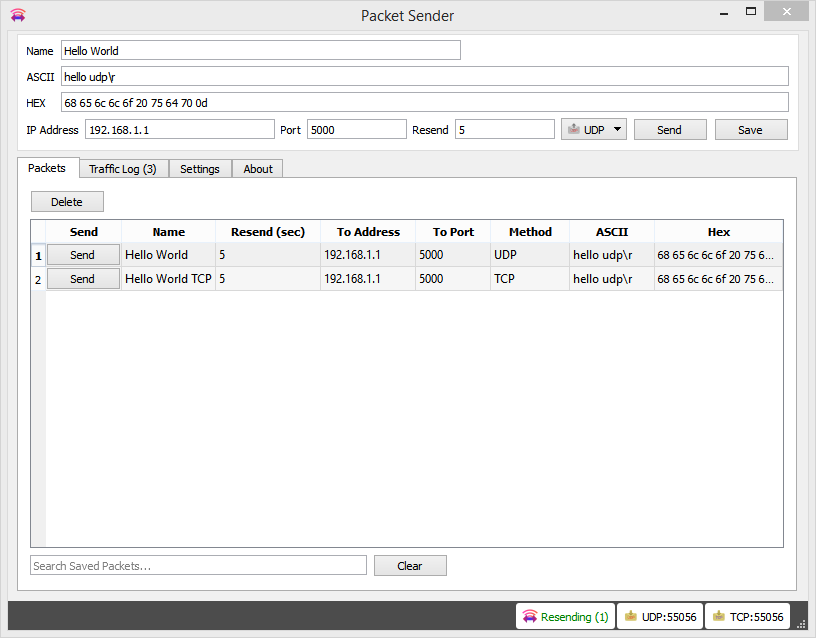

# Packet Sender

Packet Sender is an open source utility to allow sending and receiving TCP and UDP packets. The mainline branch officially supports Windows, Mac, and Ubuntu Desktop Linux. Other places may recompile and redistribute Packet Sender. Packet Sender is free and licensed GPL v2 or later. It can be used for both commercial and personal use.

## Download
Official releases of Packet Sender can be downloaded at  [PacketSender.com](http://packetsender.com/). Some places redistribute Packet Sender.

## Packet Sender Documentation

Some knowledge of a basic network protocols is a prerequisite to using Packet Sender. Beyond that, Packet Sender was designed to be very easy to use. Simply start using it.

### Support

* Stack Overflow: [stackoverflow.com/search?q=packet+sender](http://stackoverflow.com/search?q=packet+sender)
* Twitter: [@NagleCode](http://twitter.com/naglecode)
* You may also track this project on GitHub.
* Secure Anonymous Email: [DanNagle.com/contact](http://DanNagle.com/contact)

### Portable Mode

Packet Sender has a "portable" mode. At launch, it will look for `packets.ini` and `ps_settings.ini` in its run-time directory. Windows users, this directory is the same place as the .exe. For Mac users, this run-time directory is at "PacketSender.app/Contents/MacOS". If INI files are found, it will use them instead of %APPDATA%" or "Library/Application Support".

### Documentation (GUI)

Packet Sender is identical for all the desktop versions. The only difference is its theme to match the operating system.

* In the bottom right, there are UDP server and TCP server status and port. You can click to activate or deactivate these.
* During packet resending, there will be a button to cancel all resends.
* Please check your firewall. Windows aggressively blocks TCP-based servers. Packet Sender will still work if the firewall blocks it, but it can't receive unsolicited TCP-based packets.
* In the table, there is a list of saved packets. You can double-click to directly edit fields in this table.
* Select multiple packets to enable "Multi-Send". Selected packets are shown in a quick-send area above the traffic log.
* Fields can be rearranged by drag-and-drop in the settings menu.
* A resend value of "0" means it is a single-shot packet.
* A packet has a name, destination address (domains will trigger an IP lookup), port, and data associated with it.
* Click "Send" to immediately send. Click "Save" to send later.
* Packet Sender supports mixed ASCII and HEX notation:
  * \XX gets translated to XX in hex
  * \n and \r will get translated to 0A and 0D
  * HEX numbers are space delimited
  * Example ASCII: hello world\r
  * Example HEX: 68 65 6c 6c 6f 20 77 6f 72 6c 64 0d
  * You may save a packet directly from the traffic log. You will be prompted for a name, and the source address and port will be switched for your convenience.
* An optional response can be sent. The same response is used for TCP and UDP.

### Persistent TCP
Packet Sender supports persistent connections via a separate UI dialog. It is enabled by  checkbox on the main window.

* Any number of persistent connections can be created.
* Previously saved packets can be loaded in the drop-down.
* There is a "raw" view and "ASCII" view. The ASCII view is useful to troubleshoot data that is not printed by the raw view.
* Traffic is also saved in the main window traffic log.
* The timer in the bottom lefts starts as soon as a valid data packet is sent. It stops when the server closes the connection.
* You may optionally append a carriage return when you quick-send by hitting the return key. This is useful for command-prompt menus over TCP connections.

Persistent connections is not supported via the command line.

### IPv4 Subnet Calculator
Packet Sender has a built-in subnet calculator. It is under the Tools menu.

* The log window will display non-loopback IPv4 addresses found on your computer.
* The top left field allow inputting an IPv4 address.
* The field below is for a subnet, either X.X.X.X or /XX notation.
* The results of the calculation are on the right.
* The field below is a quick check to see if an IPv4 is within one of your subnets.

### Additional Configuration Options

* The traffic log and packet table is divided by a draggable splitter. This splitter can also be collapsed on either side.
* Copy to the clipboard the raw packet data (instead of a translation -- my personal preference)
* Traffic log can be set to roll at 100 entries.
* Import/Export of packets is available via menus.
* Attempt receive before send (some servers expect this behavior).
* 500 ms delay before sending data (some servers are slow).

### Tools

Subnet Calculator (place holder until finished)

## Documentation (Command Line)

The command line extension used in Windows installations is .com. Using .exe will launch the GUI. Leave off the extension and Windows will choose the correct program. The same executable controls the command line and GUI for Mac and Linux operating systems.

The command line system in Packet Sender follows the same pattern as other Linux utilities. It has a long name (such as --version) and a short name (such as -v). These options can be arranged in any order and Packet Sender will parse them correctly. The last 3 options are positional and must appear last. They are IP, port, and data. These last options are optional if using a stored packet.

    packetsender --help
    Usage: packetsender [options] address port data
    Packet Sender is a Network TCP and UDP Test Utility by Dan Nagle
    See http://PacketSender.com/ for more information.

    Options:
    -?, -h, --help 	Displays this help.
    -v, --version 	Displays version information.
    -q, --quiet 	Quiet mode. Only output received data.
    -x, --hex 	Parse data as hex (default).
    -a, --ascii 	Parse data as mixed-ascii (like the GUI).
    -A, --ASCII 	Parse data as pure ascii (no \xx translation).
    -w, --wait <milliseconds> 	Wait up to <milliseconds> for a response after sending. Zero means do not wait (Default).
    -f, --file <path> 	Send contents of specified path. Max 1024 for UDP, 10 MiB for TCP.
    -b, --bind <port> 	Bind port. Default is dynamic.
    -t, --tcp 	Send TCP (default).
    -u, --udp 	Send UDP.
    -n, --name <name> 	Send previously saved packet named <name>. Other options overrides saved packet parameters.

    -Arguments:
    -address 	Destination address. Optional for saved packet.
    -port 	Destination port. Optional for saved packet.
    -data 	Data to send. Optional for saved packet.

### Example CLI

    packetsender -taw 500 packetsender.com 22 "Hello\nWorld"
    TCP (56620)://192.185.38.130 48 65 6c 6c 6f 0a 57 6f 72 6c 64
    Response HEX:53 53 48 2D 32 2E 30 2D 4F 70 65 6E 53 53 48 5F 35 2E 33 70 31 20 44 65 62 69 61 6E 2D 33 75 62 75 6E 74 75 33 2E 31 2E 49 53 2E 31 30 2E 30 34 0D 0A
    Response ASCII:SSH-2.0-OpenSSH_5.3p1 Debian-3ubuntu3.1.IS.10.04\r\n

## Mobile Versions

The abandoned mobile versions are written in Java and Swift and are MIT Licensed.  
* [Source for Packet Sender for Android](https://github.com/dannagle/PacketSender-Android).
* [Source for Packet Sender for for iOS](https://github.com/dannagle/PacketSender-iOS).

The desktop version is by far more capable and more popular and is now the sole focus of the project.

## License
GPL v2 or Later. [Contact me](http://dannagle.com/contact) if you require a different license.

## Copyright

Packet Sender is wholly owned and copyright &copy;  -  [@NagleCode](http://twitter.com/NagleCode) - [DanNagle.com](http://DanNagle.com)  -  [PacketSender.com](http://PacketSender.com)
