# Packet Sender


[](https://packetsender.com/download)

Packet Sender is an open source utility to allow sending and receiving TCP, UDP, and SSL (encrypted TCP) packets. The mainline branch officially supports Windows, Mac, and Desktop Linux (with Qt). Other places may recompile and redistribute Packet Sender. Packet Sender is free and licensed GPL v2 or later. It can be used for both commercial and personal use.

## Sponsors

Packet Sender would like to thank the following sponsors.

[](https://iwl.com/)
<br>IWL is a California company creating computer networking products.
<br><br><br>

[](https://dannagle.com)
<br>NagleCode is a software publisher and development studio. NagleCode licenses the mobile apps.
<br><br><br>

[](https://www.jetbrains.com/?from=PacketSender)
<br>JetBrains provides world-class programming tools to help speed development.
<br><br><br>

[](https://github.com/sponsors/dannagle)
<br>GitHub provides repositories, downloads, and issue tracking for any code project.
<br><br><br>

[Would you like your name/logo listed here?](https://github.com/sponsors/dannagle)


### Support

* Twitter: [@NagleCode](http://twitter.com/NagleCode)
* Forums are at: [GitHub Discussions](https://github.com/dannagle/PacketSender/discussions).
* Email: [Packet Sender Contact](https://packetsender.com/contact)
* Connect with me on [LinkedIn](https://www.linkedin.com/in/dannagle/)

*NOTE:* Try (temporarily) disabling your firewall if having problems in Windows.

## Uses

* Controlling network-based devices in ways beyond their original apps
* Test automation (using its command line tool and/or hotkeys)
* Testing network APIs (using the built-in TCP, UDP, SSL clients)
* Malware analysis (using the built-in UDP, TCP, SSL servers)
* Troubleshooting secure connections (using SSL ).
* Testing network connectivity/firewalls (by having 2 Packet Senders talk to each other)
* Stress-testing a device (using intense network generator tool)
* Tech support (by sending customers a portable Packet Sender with pre-defined settings and packets)
* Sharing/Saving/Collaboration using the [Packet Sender Cloud](https://cloud.packetsender.com/) service.

## Desktop Download

Official releases of Packet Sender can be downloaded at  [PacketSender.com](http://packetsender.com/download). Some places redistribute Packet Sender.

  

## Mobile Apps
The Packet Sender mobile editions are fully native, contain bare minimum permissions, and collects no data. This is software that respsects you. Thank you for supporting this effort.

### Android


The Android version is located [on Google Play](https://play.google.com/store/apps/details?id=com.packetsender.compose) or [on Amazon Appstore](https://www.amazon.com/dp/B08RXM6KM2/)


[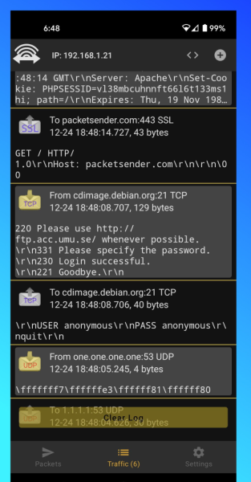](https://play.google.com/store/apps/details?id=com.packetsender.compose)

### iOS


The iOS version is located [on the Apple App Store](https://apps.apple.com/app/id1558236648#?platform=iphone)


[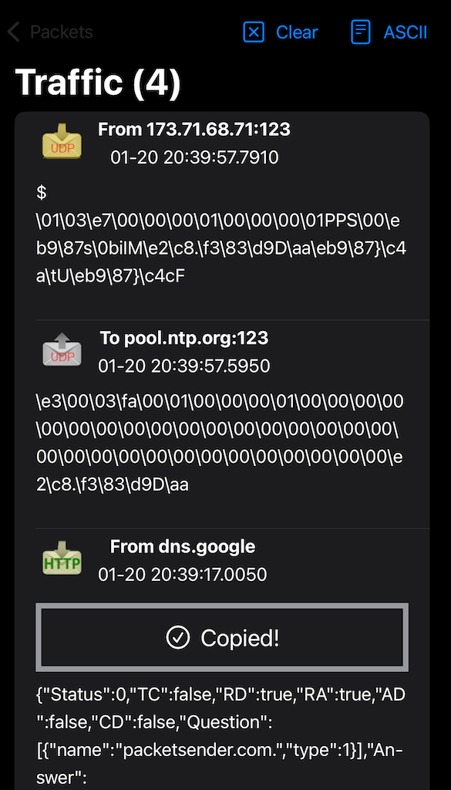](https://apps.apple.com/app/id1558236648#?platform=iphone)


## Packet Sender Cloud

Packets sets can be quickly saved/retrieved/shared using the free [Packet Sender Cloud](https://cloud.packetsender.com/) service. The cloud may also be used to publicly display and distribute your packets (via an URL) for collaboration, tutorials, end users, etc. Packet Sender may import public packet sets with public URL.

There are various reasons to do this:

* Keeping all your packets ready so you can quickly retrieve them when installing a fresh Packet Sender
* Quickly swapping between packet sets when working on different projects.
* Sharing a login (it is allowed) for collaborative packet set generation
* Having a public page of your packet sets so others can quickly find and import

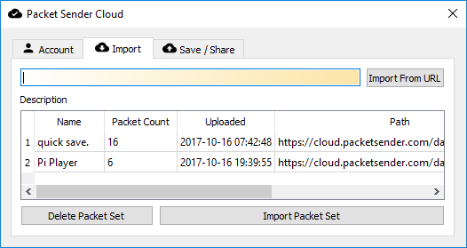

If you are publishing a network API, maintaining a public cloud page is significantly easier than painfully detailing (IP, port, type, etc) the packets to your users. Plus, updating that page is easy.

More information about it can be found at
https://cloud.packetsender.com/help

### Portable Mode

Packet Sender has a "portable" mode. At launch, it will look for `packets.ini` and `ps_settings.ini` in
its run-time directory. For the SSL server, it will look for `ps.key` and `ps.pem`.

Windows users, this directory is the same place as the .exe.
For Mac users, this run-time directory is at `PacketSender.app/Contents/MacOS`.
If INI files are found, it will use them instead of `%APPDATA%` or `Library/Application Support`.

### IPv4, IPv6, and Custom IP

Packet Sender's built-in servers are configured to support either IPv4 or IPv6 but not both at the same time. For clients, Packet Sender GUI and CLI will seemlessly switch between the two modes upon sending (you may need to include the scope ID). Older versions of Packet Sender tried use both simultaneously, but testing found this unreliable. Click the IPv4 / IPv6 toggle on the bottom right to switch between the two.

Inside the settings, you may also force Packet Sender's servers to bind to a custom IP address. This can be very useful for systems with multiple NICs or complicated IP setups. Packet Sender will trigger an error if told to bind to an address that does not exist.

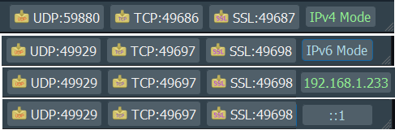

## Multicast (Experimental)

Packet Sender's multicast support is triggered by attempting to send to a IPv4 multicast address or via the mulitcast submenu). The feature is currently experimental and has these known problems.

* Packet Sender abandons IPv6 support when joining multicast.
* And stays abandoned until you revisit settings or attempt to send to IPv6
* On wifi, it sometimes takes 20 seconds for multicast join to actually take effect.
* Packet Sender has no logic to rejoin a mulitcast group if the switch reboots or some other common error.

There is no IPv6 multicast support, though it is on the roadmap. Sponsors wanting IPv6 multicast support are welcome to contact me.

### UDP Traffic Generator (Experimental)

For when the normal send system is not enough, you can now hammer a target IP with packets to see if your device can handle it. Please note that this feature is experimental and the metrics displayed have not been fully tested.

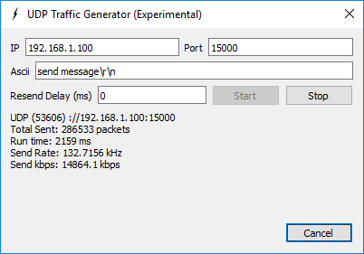

### Additional Documentation (GUI)

Packet Sender is identical for all the desktop versions. The only difference is its theme to match the operating system.

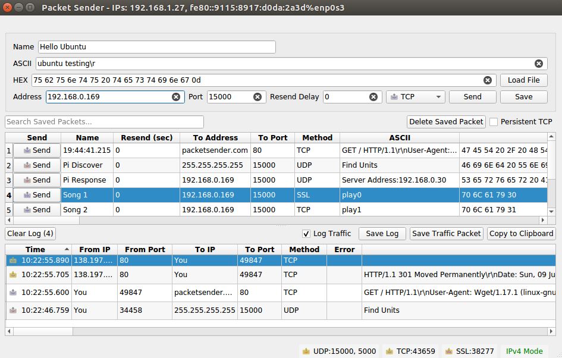

* In the bottom right, there are UDP, TCP, and SSL server status and port(s). You can click to activate or deactivate these. Packet Sender supports binding to any number of ports.
* There is also IPv4 (default), IPv6, custom IP, toggle button
* During packet resending, there will be a button to cancel all resends.
* Please check your firewall. Windows aggressively blocks TCP-based servers. Packet Sender will still work if the firewall blocks it, but it can't receive unsolicited TCP-based packets.
* In the table, there is a list of saved packets. You can double-click to directly edit fields in this table.
* Select multiple packets to enable "Multi-Send". Selected packets are shown in a quick-send area above the traffic log.
* Fields can be rearranged by drag-and-drop in the settings menu.
* A resend value of "0" means it is a single-shot packet.
* A packet has a name, destination address (domain names are default resolved just before sending), port, and data associated with it.
* Click "Send" to immediately send. Click "Save" to send later.
* For IPv6 sending, you will also need the scope ID.
* Packet Sender supports mixed ASCII and HEX notation:
  * \XX gets translated to XX in hex
  * \n, \r, \t will get translated to 0A, 0D, and 09
  * HEX numbers are space delimited
    * The HEX field will attempt to interpret other common delimiters (such as commas, colons (Wireshark), semicolons, " 0x", etc) and auto-correct.
    * A single stream of HEX is also supported. If the number of bytes is odd, Packet Sender will assume the front byte needs a zero and then auto-correct.
  * Example ASCII: hello world\r
  * Example HEX: 68 65 6c 6c 6f 20 77 6f 72 6c 64 0d
  * You may save a packet directly from the traffic log. You will be prompted for a name, and the source address and port will be switched for your convenience.
  * You may also load a file directly in to the HEX field. The HEX field supports sending up to 10,922 bytes. The theoretical limit for sending via the command line is 200 MB.
* An optional response can be sent. The same response is used for TCP and UDP.

### Hotkeys / Keyboard Shortcuts

The fields at the top can be navigated using CTRL+1, CTRL+2, etc, up to CTRL+8 (send button). On Mac, the shortcut key is Command.

Some notes:

* When you navigate to the TCP/UDP/SSL option, you may use up/down or t/u/s characters.
* If you are going to automate with hotkeys (using tools such at [AutoHotKey](https://www.autohotkey.com/)), you may want to turn off "Restore previous session".

### SSL Client and Server

Packet Sender supports establishing encrypted connections over SSL.
This is supported in the GUI and on the command line. Some notes on this:

* The certificate negotiation is handled immediately during connection.
* By default, Packet Sender ignores all SSL errors (expired cert, wrong host name, self-signed, etc).
* Packet Sender outputs the cert negotiation progress in to the traffic log.
* Packet Sender outputs the encryption algorithm used in the traffic log (such as AES 128).

Packet Sender bundles an internal "Snake Oil" certificate for use as a server for Windows. The certificate and key is in the same place as packet and settings.

* Overriding the cert locations in Settings also overrides these snake-oil certificate.

Packet Sender bundles OpenSSL for use in Windows. On Mac and Linux, Packet Sender will use the native SSL libraries.

_This product includes software developed by the OpenSSL Project for use in the OpenSSL Toolkit. (http://www.openssl.org/)_

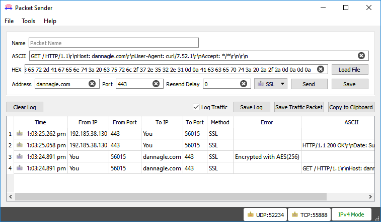

* If there is an SSL error, Packet Sender will output it to the traffic log. If the setting is to continue anyway (default), it will continue to negotiate encryption. Otherwise, the connection ends with failure to connect.

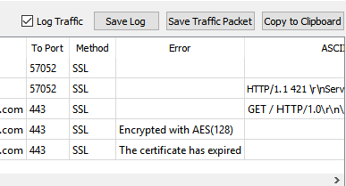

### Smart Responses

Packet Sender supports up to 5 smart responses. To use it, disable normal responses.
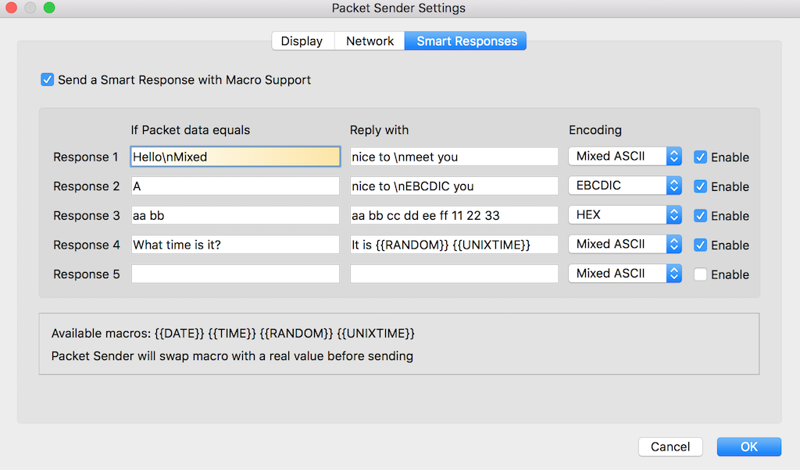

* Packet Sender will compare the packet within the encoding you choose.
* Packet Sender translates the encoding before sending out the reply.
* The available encodings are:
  * Mixed ASCII -- The standard Packet Sender way of encoding ASCII along with non-printable characters
  * HEX -- Packet Sender's normal HEX encoding
  * [EBCDIC](https://en.wikipedia.org/wiki/EBCDIC) (deprecated) -- An encoding used mostly by IBM mainframes. The input field is normal Mixed ASCII and is translated when performing the comparison and sending.

### Macros

Packet Sender supports these macros when sending responses:

* {{DATE}} -- Sends the current date in "yyy-mm-dd" format.
* {{TIME}} -- Sends the current time in "hh:mm:ss ap" format.
* {{UNIXTIME}} -- Sends the current epoch time stamp.
* {{RANDOM}} -- Sends a random number ranging from either 0 to 32767 or 2147483647, depending on 32-bit or 64-bit (default installer for Windows is 32-bit. Mac is 64-bit).
* {{UNIQUE}} -- Sends a random string. Uses an internal UUID to generate it.
Packet Sender will swap the macro with real values before sending.

### Persistent TCP and SSL

Packet Sender supports persistent TCP and SSL connections via a separate UI dialog. It is enabled by checkbox on the main window or in the settings dialog.

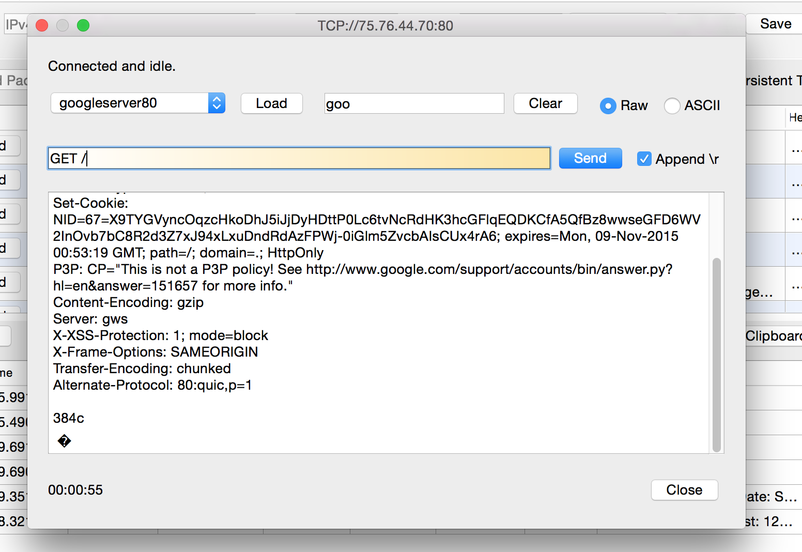

* Any number of persistent connections can be created.
* Previously saved packets can be loaded in the drop-down.
* There is a "raw" view and "ASCII" view. The ASCII view is useful to troubleshoot data that is not printed by the raw view.
* Traffic is also saved in the main window traffic log.
* A file may be uploaded to the persistent connection. You may wish to turn off logging if you use this.
* The timer in the bottom lefts starts as soon as a valid data packet is sent/received. It stops when the connection is closed.
* You may optionally append a carriage return when you quick-send by hitting the return key. This is useful for command-prompt menus over TCP  / SSL connections. Packet Sender remembers previous state of \r checkbox.
* Incoming persistent connections to the server will launch the UI dialog.
* During resend, the persistent connection packet is carried over to the new UI dialog. Clicking "Resending(1)" will cancel it.

Persistent connections are not supported via the command line.

### IPv4 Subnet Calculator

Packet Sender has a built-in subnet calculator. It is under the Tools menu.
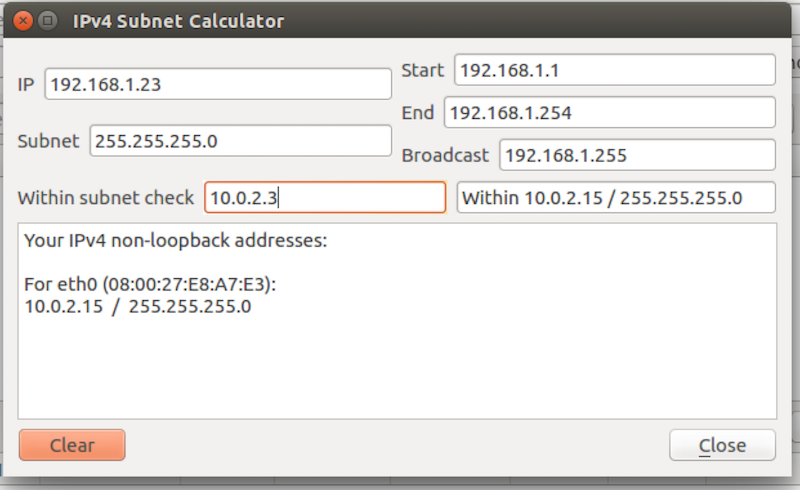

* The log window will display non-loopback IPv4 and IPv6 addresses found on your computer.
* The top left field allow inputting an IPv4 address.
* The field below is for a subnet, either X.X.X.X or /XX notation.
* The results of the calculation are on the right.
* The field below is a quick check to see if an IPv4 is within one of your subnets.

### Additional Configuration Options

* IPv4 Mode, IPv6 Mode, Custom IP in the servers. This is identical to the toggle switch except toggle switch does not remember custom IP.
* The traffic log and packet table is divided by a draggable splitter. This splitter can also be collapsed on either side.
* Copy to the clipboard the raw packet data (default). If your data has a large amount of non-ASCII characters, you may prefer a translated version.
* Resending can be auto-cancelled after X number of packets. Set to 0 to resend forever.
* Traffic log can be set to roll at 100 entries. Otherwise, the log rolls at 10k.
* Import/Export of packets is available via menus.
* Attempt receive before send (some servers expect this behavior).
* 500 ms delay before sending data (some servers are slow).
* Enable keyboard shortcut for ASCII --> EBCDIC translation (deprecated).
* Resolve DNS during input. The default is to resolve DNS just before sending.
* Ignore SSL errors. Packet Sender will note the error and continue with encryption. Otherwise, Packet Sender abandons the connection. The SSL server always ignores errors.

## Documentation (Command Line)

The command line extension used in Windows installations is .com. Using .exe will launch the GUI. Leave off the extension and Windows will choose the correct program. The same executable controls the command line and GUI for Mac and Linux operating systems.

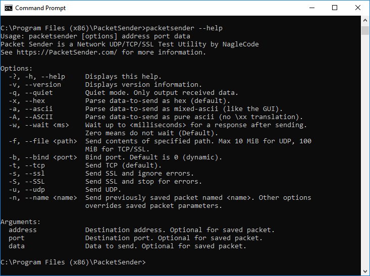

The command line system in Packet Sender follows the same pattern as other Linux utilities. It has a long name (such as --version) and a short name (such as -v). These options can be arranged in any order and Packet Sender will parse them correctly. The last 3 options are positional and must appear last. They are IP, port, and data. These last options are optional if using a stored packet.

    packetsender --help
    Usage: packetsender [options] address port data
    Packet Sender is a Network UDP/TCP/SSL Test Utility by NagleCode
    See https://PacketSender.com/ for more information.

    Options:
    -?, -h, --help     Displays this help.
    -v, --version      Displays version information.
    -q, --quiet        Quiet mode. Only output received data.
    -x, --hex          Parse data-to-send as hex (default).
    -a, --ascii        Parse data-to-send as mixed-ascii (like the GUI).
    -A, --ASCII        Parse data-to-send as pure ascii (no \xx translation).
    -w, --wait <ms>    Wait up to <milliseconds> for a response after sending.
                          Zero means do not wait (Default).
    -f, --file <path>  Send contents of specified path. Max 10 MiB for UDP, 100
                           MiB for TCP/SSL.
    -b, --bind <port>  Bind port. Default is 0 (dynamic).
    -6, --ipv6         Force IPv6. Same as -B "::". Default is IP:Any.
    -4, --ipv4         Force IPv4.    Same as -B "0.0.0.0". Default is IP:Any.
    -B, --bindip <IP>  Bind custom IP. Default is IP:Any.
    -t, --tcp          Send TCP (default).
    -s, --ssl          Send SSL and ignore errors.
    -S, --SSL          Send SSL and stop for errors.
    -u, --udp          Send UDP.
    -n, --name <name>  Send previously saved packet named <name>. Other options
                           overrides saved packet parameters.

    Arguments:
    address            Destination address. Optional for saved packet.
    port               Destination port. Optional for saved packet.
    data               Data to send. Optional for saved packet.

### Example CLI

    packetsender -taw 500 mirrors.xmission.com 21 "USER anonymous\r\nPASS chrome@example.com\r\n"
    TCP (65505)://mirrors.xmission.com:21 55 53 45 52 20 61 6e 6f 6e 79 6d 6f 75 73 0d 0a 50 41 53 53 20 63 68 72 6f 6d 65 40 65 78 61 6d 70 6c 65 2e 63 6f 6d 0d 0a
    Response Time:5:51:37.042 pm
    Response HEX:32 32 30 2D 57 65 6C 63 6F 6D 65 20...
    Response ASCII:220-Welcome to XMission Internet...

### Examples binding to port and custom IP, IPv4, or IPv6

Packet Sender command line can bind to custom ports to force IPv4/6 modes or multiple NIC.

    packetsender -taw 3000 fe80::c07b:d517:e339:5a08 5005 "Hello\r"
    packetsender -taw 3000 192.168.0.201 5005 "Hello\r"
    packetsender -B 192.168.0.200 -taw 3000 192.168.0.201 5005 "Hello\r"
    packetsender -B fe80::a437:399a:3091:266a%ethernet_32769 -taw 3000 fe80::c07b:d517:e339:5a08 5005 "Hello\r"
    packetsender -B fe80::a437:399a:3091:266a -taw 3000 fe80::c07b:d517:e339:5a08 5005 "Hello\r"

### Example CLI using SSL and ignoring errors

The command line has the option to ignore or abandon on SSL errors. The default is to ignore.

    packetsender -saw 500 expired.packetsender.com 443 "GET / HTTP/1.0\r\n\r\n"
    SSL Error: The certificate has expired
    SSL (54202)://expired.packetsender.com:443 47 45 54 20 2f 20 48 54 54 50 2f 31 2e 30 0d 0a 0d 0a
    Cipher: Encrypted with AES(128)

    Response Time:3:24:55.695 pm
    Response HEX:48 54 54 50 2f 31 2e 31 20 34 32 31 20 0d 0a 53 65 72 76 65 72 3a 20 6e 67 69 6e 78 2f 31 2e 31 30 2e 30 20 28 55 62 75 6e 74 75 29 0d
    Response ASCII:HTTP/1.1 421 \r\nServer: nginx/1.10.0 (Ubuntu)\r

## Building Packet Sender

The only dependency is Qt SDK. Here is how to build the app.

### Build for Windows and Mac

1. Download the Qt installer from http://www.qt.io/download-open-source/
1. Let it install MingGW if you don't have a compiler.
1. Open the project PacketSender.pro
1. Build! Qt is the only dependency!

The Windows and Mac versions were built using Qt 5.12

### Build for Linux

Here is the sequence of commands for Ubuntu 16.04. Please adapt to your Linux platform. Packet Sender requires no additional libraries beyond the stock Qt SDK. I have been told there are build issues with stock Fedora. If a Fedora wizard has insight, please let me know, and I'll add your instructions.

If you are feeling adventurous, feel free to build from the master branch. It contains the latest stable build. The development branch should probably be avoided.

```
sudo apt-get update
sudo apt-get install qt5-default build-essential
wget https://github.com/dannagle/PacketSender/archive/(Version).tar.gz
tar -xzvf (Version).tar.gz
cd PacketSender-(Version)/src
qmake PacketSender.pro
make
```

To run use:
```
./PacketSender
```

If it doesn't run, you may need to set it executable
```
chmod a+x PacketSender
```

## Enhancements

Missing a feature? You can [hire me to add it to Packet Sender](https://packetsender.com/enhancements).

## License

GPL v2 or Later. [Contact me](https://packetsender.com/contact) if you require a different license.

## Copyright

Packet Sender was written by [Dan Nagle](https://dannagle.com/) and is published by &copy; NagleCode, LLC   -  [@NagleCode](https://twitter.com/NagleCode) - [PacketSender.com](https://PacketSender.com)
