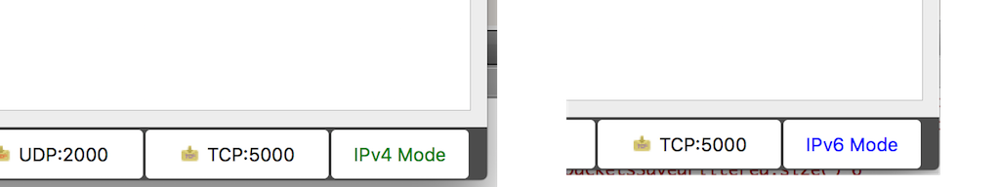
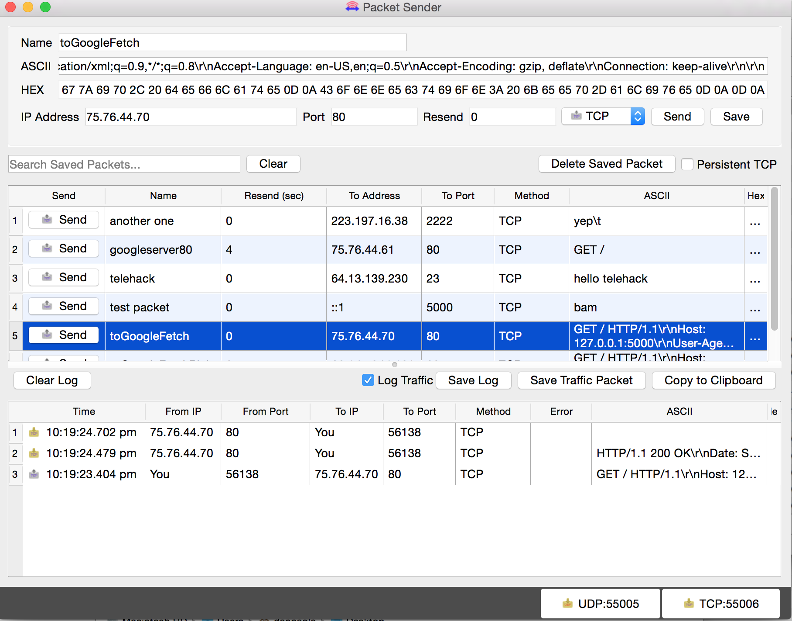

# Packet Sender


Packet Sender is an open source utility to allow sending and receiving TCP and UDP packets. Packet Sender can also send SSL (encrypted TCP) packets. The mainline branch officially supports Windows, Mac, and Desktop Linux (with Qt). Other places may recompile and redistribute Packet Sender. Packet Sender is free and licensed GPL v2 or later. It can be used for both commercial and personal use.

## Uses

* Controlling network-based devices in ways beyond their original apps
* Test automation (using its command line tool)
* Testing network APIs (using the built-in TCP and UDP clients)
* Malware analysis (using the built-in UDP and TCP servers)
* Troubleshooting secure connections (using the SSL client).
* Testing network connectivity/firewalls (by having 2 Packet Senders talk to each other)
* Tech support (by sending customers a portable Packet Sender with pre-defined settings and packets)

## Download
Official releases of Packet Sender can be downloaded at  [PacketSender.com](http://packetsender.com/). Some places redistribute Packet Sender.

  

## Packet Sender Documentation

Some knowledge of basic network protocols is a prerequisite to using Packet Sender. Beyond that, Packet Sender was designed to be very easy to use. Simply start using it.


### Support

* Twitter: [@NagleCode](http://twitter.com/naglecode)
* You may also track this project on [GitHub](http://github.com/dannagle/PacketSender).
* Secure Anonymous Email: [DanNagle.com/](http://DanNagle.com/)

### Portable Mode

Packet Sender has a "portable" mode. At launch, it will look for `packets.ini` and `ps_settings.ini` in its run-time directory. Windows users, this directory is the same place as the .exe. For Mac users, this run-time directory is at "PacketSender.app/Contents/MacOS". If INI files are found, it will use them instead of %APPDATA%" or "Library/Application Support".


### IPv4 and IPv6 Support
By default, Packet Sender's built-in servers are configured to support IPv4. If you wish to use IPv6, there is a toggle switch at the bottom right. Click to switch between IPv4 / IPv6.



Packet Sender's GUI client sender and CLI will detect the type of IP address being used and bind appropriately to send the packet. Note that you must include a scope ID to send.


### Documentation (GUI)

Packet Sender is identical for all the desktop versions. The only difference is its theme to match the operating system.




* In the bottom right, there are UDP server and TCP server status and port. You can click to activate or deactivate these. There is no built-in SSL server.
* There is also IPv4 Mode and IPv6 Mode. Click to toggle between server modes.
* During packet resending, there will be a button to cancel all resends.
* Please check your firewall. Windows aggressively blocks TCP-based servers. Packet Sender will still work if the firewall blocks it, but it can't receive unsolicited TCP-based packets.
* In the table, there is a list of saved packets. You can double-click to directly edit fields in this table.
* Select multiple packets to enable "Multi-Send". Selected packets are shown in a quick-send area above the traffic log.
* Fields can be rearranged by drag-and-drop in the settings menu.
* A resend value of "0" means it is a single-shot packet.
* A packet has a name, destination address (domain names are default resolved just before sending), port, and data associated with it.
* Click "Send" to immediately send. Click "Save" to send later.
* For IPv6 sending, you will also need the scope ID.
* Packet Sender supports mixed ASCII and HEX notation:
  * \XX gets translated to XX in hex
  * \n, \r, \t will get translated to 0A, 0D, and 09
  * HEX numbers are space delimited
    * The HEX field will attempt to interpret other common delimiters (such as commas, colons (Wireshark), semicolons, " 0x", etc) and auto-correct.  
    * A single stream of HEX is also supported. If the number of bytes is odd, Packet Sender will assume the front byte needs a zero and then auto-correct.
  * Example ASCII: hello world\r
  * Example HEX: 68 65 6c 6c 6f 20 77 6f 72 6c 64 0d
  * You may save a packet directly from the traffic log. You will be prompted for a name, and the source address and port will be switched for your convenience.
  * You may also load a file directly in to the HEX field. The HEX field supports sending up to 10,922 bytes. The theoretical limit for sending via the command line is 200 MB.
* An optional response can be sent. The same response is used for TCP and UDP.


### SSL
Packet Sender supports establishing encrypted connections over SSL. This is supported in the GUI and on the command line. Some notes on this:

* The certificate negotiation is handled transparently.
* By default, Packet Sender ignores all SSL errors (expired cert, wrong host name, weak encryption, etc).
* Packet Sender outputs the cert negotiation progress in to the traffic log.
* Packet Sender outputs the encryption algorithm used in the traffic log (such as AES 128).


* If there is an SSL error, Packet Sender will output it to the traffic log. If the setting is to continue anyway (default), it will continue to negotiate encryption. Otherwise, the connection ends with failure to connect.


### Smart Responses
Packet Sender supports up to 5 smart responses. To use it, disable normal responses.

* Packet Sender will compare the packet within the encoding you choose.
* Packet Sender translates the encoding before sending out the reply.
* The available encodings are:
  * Mixed ASCII -- The standard Packet Sender way of encoding ASCII along with non-printable characters
  * HEX -- Packet Sender's normal HEX encoding
  * [EBCDIC](https://en.wikipedia.org/wiki/EBCDIC) -- An encoding used mostly by IBM mainframes. The input field is normal Mixed ASCII and is translated when performing the comparison and sending.

### Macros
Packet Sender supports these macros when sending responses:
* {{DATE}} -- Sends the current date in "yyy-mm-dd" format.
* {{TIME}} -- Sends the current time in "hh:mm:ss ap" format.
* {{UNIXTIME}} -- Sends the current epoch time stamp.
* {{RANDOM}} -- Sends a random number ranging from either 0 to 32767 or 2147483647, depending on 32-bit or 64-bit (default installer for Windows is 32-bit. Mac is 64-bit).
Packet Sender will swap the macro with real values before sending.

### Persistent TCP and SSL
Packet Sender supports persistent TCP and SSL connections via a separate UI dialog. It is enabled by checkbox on the main window or in the settings dialog.


* Any number of persistent connections can be created.
* Previously saved packets can be loaded in the drop-down.
* There is a "raw" view and "ASCII" view. The ASCII view is useful to troubleshoot data that is not printed by the raw view.
* Traffic is also saved in the main window traffic log.
* The timer in the bottom lefts starts as soon as a valid data packet is sent/received. It stops when the connection is closed.
* You may optionally append a carriage return when you quick-send by hitting the return key. This is useful for command-prompt menus over TCP  / SSL connections.
* Incoming persistent connections to the server will launch the UI dialog.
* During resend, the persistent connection packet is carried over to the new UI dialog. Clicking "Resending(1)" will cancel it.

Persistent connections are not supported via the command line.


### IPv4 Subnet Calculator
Packet Sender has a built-in subnet calculator. It is under the Tools menu.

* The log window will display non-loopback IPv4 and IPv6 addresses found on your computer.
* The top left field allow inputting an IPv4 address.
* The field below is for a subnet, either X.X.X.X or /XX notation.
* The results of the calculation are on the right.
* The field below is a quick check to see if an IPv4 is within one of your subnets.

### Additional Configuration Options

* IPv4 Mode or IPv6 Mode in the servers. This is identical to the toggle switch.
* The traffic log and packet table is divided by a draggable splitter. This splitter can also be collapsed on either side.
* Copy to the clipboard the raw packet data (instead of a translation -- my personal preference)
* Resending can be auto-cancelled after X number of packets. Set to 0 to resend forever.
* Traffic log can be set to roll at 100 entries.
* Import/Export of packets is available via menus.
* Attempt receive before send (some servers expect this behavior).
* 500 ms delay before sending data (some servers are slow).
* Enable keyboard shortcut for ASCII --> EBCDIC translation.


## Documentation (Command Line)

The command line extension used in Windows installations is .com. Using .exe will launch the GUI. Leave off the extension and Windows will choose the correct program. The same executable controls the command line and GUI for Mac and Linux operating systems.


The command line system in Packet Sender follows the same pattern as other Linux utilities. It has a long name (such as --version) and a short name (such as -v). These options can be arranged in any order and Packet Sender will parse them correctly. The last 3 options are positional and must appear last. They are IP, port, and data. These last options are optional if using a stored packet.


    packetsender --help
    Usage: packetsender [options] address port data
    Packet Sender is a Network TCP and UDP Test Utility by Dan Nagle
    See http://PacketSender.com/ for more information.

    Options:
    -?, -h, --help 	Displays this help.
    -v, --version 	Displays version information.
    -q, --quiet 	Quiet mode. Only output received data.
    -x, --hex 	Parse data as hex (default).
    -a, --ascii 	Parse data as mixed-ascii (like the GUI).
    -A, --ASCII 	Parse data as pure ascii (no \xx translation).
    -w, --wait <ms> Wait up to <milliseconds> for a response after sending. Zero means do not wait (Default).
    -f, --file <path> 	Send contents of specified path. Max 1024 for UDP, 10 MiB for TCP.
    -b, --bind <port> 	Bind port. Default is dynamic.
    -t, --tcp 	Send TCP (default).
    -s, --ssl   Send SSL and ignore errors.
    -S, --SSL   Send SSL and stop for errors.
    -u, --udp   Send UDP.    
    -n, --name <name> 	Send previously saved packet named <name>. Other options overrides saved packet parameters.

    -Arguments:
    -address 	Destination address. Optional for saved packet.
    -port 	Destination port. Optional for saved packet.
    -data 	Data to send. Optional for saved packet.


### Example CLI


    packetsender -taw 500 packetsender.com 22 "Hello\nWorld"
    TCP (56620)://192.185.38.130 48 65 6c 6c 6f 0a 57 6f 72 6c 64
    Response Time:5:51:37.042 pm
    Response HEX:53 53 48 2D 32 2E 30 2D 4F 70 65 6E 53 53 48 5F 35 2E 33 70 31 20 44 65 62 69 61 6E 2D 33 75 62 75 6E 74 75 33 2E 31 2E 49 53 2E 31 30 2E 30 34 0D 0A
    Response ASCII:SSH-2.0-OpenSSH_5.3p1 Debian-3ubuntu3.1.IS.10.04\r\n


### Example CLI using SSL and ignoring errors
The command line has the option to ignore or abandon on SSL errors. The default is to ignore.

    packetsender -saw 500 expired.packetsender.com 443 "GET / HTTP/1.0\r\n\r\n"
    SSL Error: The certificate has expired
    SSL (54202)://expired.packetsender.com:443 47 45 54 20 2f 20 48 54 54 50 2f 31 2e 30 0d 0a 0d 0a
    Cipher: Encrypted with AES(128)

    Response Time:3:24:55.695 pm
    Response HEX:48 54 54 50 2f 31 2e 31 20 34 32 31 20 0d 0a 53 65 72 76 65 72 3a 20 6e 67 69 6e 78 2f 31 2e 31 30 2e 30 20 28 55 62 75 6e 74 75 29 0d
    Response ASCII:HTTP/1.1 421 \r\nServer: nginx/1.10.0 (Ubuntu)\r

## Building Packet Sender
The only dependency is Qt SDK. Here is how to build the app.

### Build for Windows and Mac
1. Download the Qt installer from http://www.qt.io/download-open-source/
1. Let it install MingGW if you don't have a compiler.
1. Open the project PacketSender.pro
1. Build! Qt is the only dependency!

### Build for Linux
Here is the sequence of commands for Ubuntu 15.04. Please adapt to your Linux platform. Packet Sender requires no additional libraries beyond the stock Qt SDK. I have been told there are build issues with stock Fedora. If a Fedora wizard can get it to properly compile, please let me know, and I'll add your instructions.

If you are feeling adventurous, feel free to build from the master branch. It contains the latest stable build. The development branch should probably be avoided.

```
sudo apt-get update
sudo apt-get install qt5-default build-essential
wget https://github.com/dannagle/PacketSender/archive/(Version).tar.gz
tar -xzvf (Version).tar.gz
cd PacketSender-(Version)/src
qmake
make
```

To run use:
```
./PacketSender
```

If it doesn't run, you may need to set it executable
```
chmod a+x PacketSender
```

The Linux release has an Ubuntu build script that will make Packet Sender globally launchable with just `packetsender`.

## Enhancements

Missing a feature? You can [hire me to add it to Packet Sender](https://packetsender.com/enhancements).

## Mobile Versions

The abandoned mobile versions are written in Java and Swift and are MIT Licensed.  
* [Source for Packet Sender for Android](https://github.com/dannagle/PacketSender-Android).
* [Source for Packet Sender for for iOS](https://github.com/dannagle/PacketSender-iOS).

The desktop version is by far more capable and more popular and is now the sole focus of the project.


## Web site

The Packet Sender web site is also open source.
* [Repo for Packet Sender web site](https://github.com/dannagle/PacketSender-Website).


## License
GPL v2 or Later. [Contact me](http://dannagle.com/contact) if you require a different license.


## Copyright

Packet Sender is wholly owned and copyright &copy;  -  [@NagleCode](http://twitter.com/NagleCode) - [DanNagle.com](http://DanNagle.com)  -  [PacketSender.com](http://PacketSender.com)
